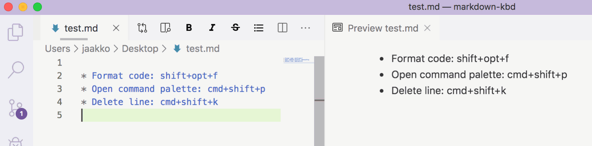
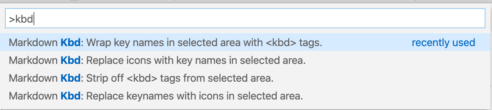

# VSCode Markdown Kbd

Make keynames and keyname combinations (such as `Cmd+R` for example)  more visible in your markdown document by wrapping key names with `<kbd>` tags.

## Features

* Auto-detects key name combination patterns from selected area and wraps them with `<kbd>` tags.
* Wraps either each key name separately or the whole key name combination, based on configuration.
* Replaces keynames, such as ctrl, cmd, opt and shift with icons (^, ⌘, ⌥, ⇧) or vice versa, based on configuration.

## How to use this extension

* Install the extension & reload developer window
* Create new markdown file or open up a markdown file.
* Insert keyname combination, such as <code>cmd+r</code>.
* If you created a new file, remember to save it with <code>.md</code> extension.
* Open command panel by hitting <kbd>cmd+shift+p</kbd>.
* Type markdown kbd and select <code>Wrap With Kbd Tags In Active Editor</code>.

## Currently supported keynames and respective icons

Keyname | Icon
-- | --
cmd | ⌘
shift | ⇧
ctrl | ^
opt | ⌥
ret | ⏎
pageup | ⇞
pagedown | ⇟
backspace | ⌫
arrRight | →
arrLeft | ←
arrUp | ↑
arrDown | ↓
tab | ⇥
alt |
esc |
space |
F10 |
F11 |
F12 |
F1 |
F2 |
F3 |
F4 |
F5 |
F6 |
F7 |
F8 |
F9 |

## Extension Settings

This extension contributes the following settings:

* <code>markdownKbd.wrapKeyNamesSeparately</code>: control whether to wrap individual key names or the key combination as a whole
* <code>markdownKbd.addSpacesAroundPlusSign</code>: control whether to use space around the plus sign, <kbd>Cmd+r</kbd> vs <kbd>Cmd + r</kbd>
* <code>markdownKbd.replaceKeynamesWithIcons</code>: control whether to replace ctrl, cmd, opt and shift with icons (^, ⌘, ⌥, ⇧).

Note: settings *do not* affect retroactively but only from that point onwards.

## Caveats

* Not all flavours of markdown support `<kbd>` elements.